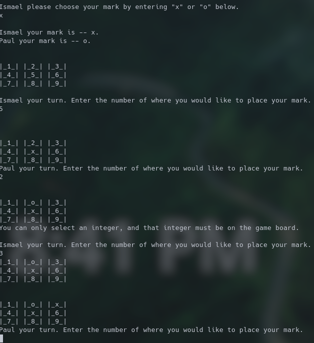

# "Tic Tac Toe"
 This is an implementation of a Tic Tac Toe GAME  for two players, X and O, who take turns marking the spaces in a 3×3 grid. The player who succeeds in placing three of their marks in a diagonal, horizontal, or vertical row is the winner. It is a solved game with a forced draw assuming best play from both players.
   this game is build in Ruby programming language.

## Screenshot

# This code includes the utilization of 
- Object-oriented programming (OOP)

## Built With

- Ruby

## Getting Started

- Open the terminal command line.
- Clone the repo:--> git clone https://github.com/Paul-Clue/tictactoe.git
- cd Tic-Tac-Toe
- Enter ./bin/main.rb to start the game.

## Instructions
- Enter player's name as prompt in the terminal.
- Enter a number from 1 upto 9 to make a move(choose a spot).
- You win when 3 of your symbols align vertically, horizontally or diagonally.
- After nine moves it's a draw if there's no winner.
- A player should play a number only once.

## AUTHORS
👤 **Paul Clue**
- GitHub: [@Paul-Clue](https://github.com/Paul-Clue/) 

👤 **Iyunda Ismael Antonio**

- GitHub: [@ixboy](https://github.com/ixboy)
- Twitter: [@ismaelixboy](https://twitter.com/ismaelixboy)
- LinkedIn: [ismael-antonio](https://www.linkedin.com/in/ismael-antonio-0b7712114/)

## 🤝 Contributing

Contributions, issues, and feature requests are welcome!

## Show your support

Give a ⭐️ if you like this project!

## 📝 License

This project is [MIT](https://opensource.org/licenses/MIT) licensed.
